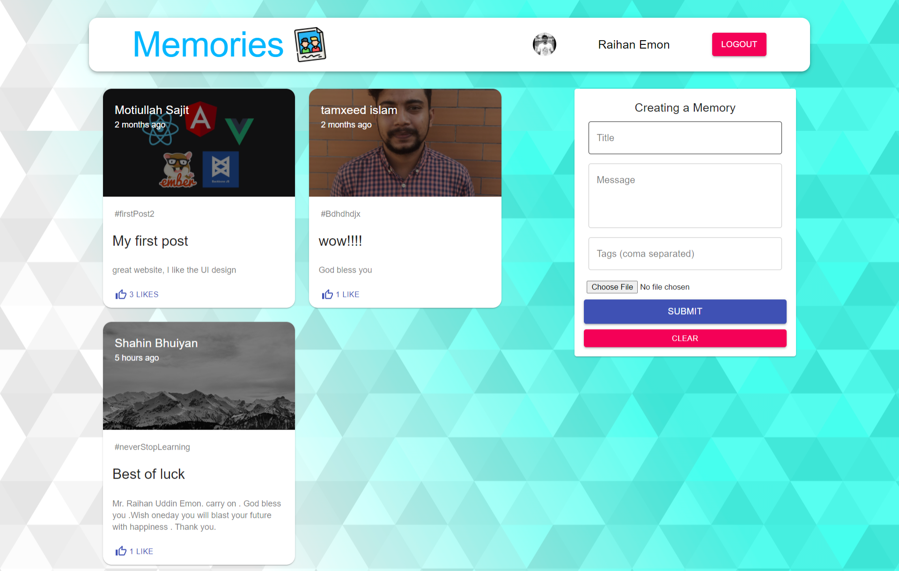

# React-Todo-List-app
#### simple react application where user can make his daily task list.

## Features:
+ User can post his memory details with image. Like facebook !!!
+ User can also edit his memories whenever he want.
+ And also can delete his memories from the site.
+ One user can like another user's memories & can like his own post.
+ LOGIN...
   * To post memories user have to login first.
   * Also login first if user wants to delete or edit his post.
   * And user can't like any post if he don't logged In.
## Special-features: 
+ There is multiple way for user login. Google Signin or create account.
+ If user logged in & don't use the site, then it will log out the loggedIn user automatically after 40 minutes.
+ 
## Technologry: 
+ Reactjs
+ Style Components
+ Material-UI
+ JWT Token
+ Session Storage
+ Firebase ( Hosting )
+ Google-auth (Google API)

##  Hit below & post your own memories
### [Live site](https://memories-e2c87.web.app/)

[Back-end-Repo](https://github.com/raihanwebmaster/MERN-Project---server)

## Take a look :)

